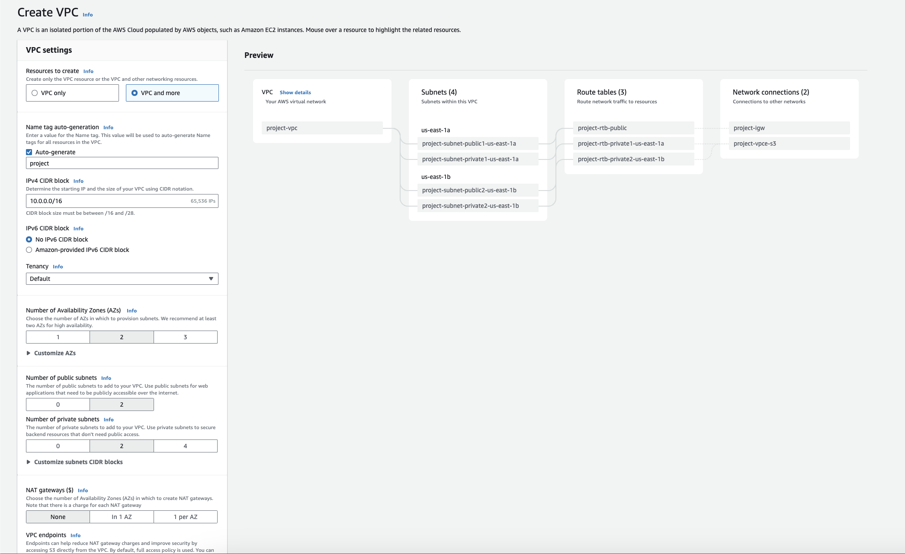

# aws-vpc-pulumi

A Pulumi NPM library to ease VPC resources setup

This library is inspired in the current version of the "Create VPC" wizard from the AWS Console:



## Install

To install this library you can use eithe `npm` or `yarn` as your would for any other Node library:

```shell
# npm
npm install @vniche/aws-vpc-pulumi

# yarn
yarn add @vniche/aws-vpc-pulumi
```

## Usage

To use this library import on your (node-based, of course) Pulumi program code. Here are some example of setups:

### VPC with two public subnets

```typescript
import { SubnetType, Network } from "@vniche/aws-vpc-pulumi";

const { vpcId, subnets } = new Network({
    cidrBlock: "10.0.0.0/20",
    subnets: [
        {
            cidrBlock: "10.0.0.0/24",
            az: "us-east-1b",
            type: SubnetType.Public,
        },
        {
            cidrBlock: "10.0.1.0/24",
            az: "us-east-1c",
            type: SubnetType.Public,
        }
    ]
});
```

### VPC with two public and two private subnets

```typescript
import { SubnetType, Network } from "@vniche/aws-vpc-pulumi";

const { vpcId, subnets } = new Network({
    cidrBlock: "10.0.0.0/20",
    subnets: [
        {
            cidrBlock: "10.0.0.0/24",
            az: "us-east-1b",
            type: SubnetType.Public,
        },
        {
            cidrBlock: "10.0.1.0/24",
            az: "us-east-1c",
            type: SubnetType.Public,
        },
        {
            cidrBlock: "10.0.2.0/24",
            az: "us-east-1a",
            type: SubnetType.Private,
        },
        {
            cidrBlock: "10.0.3.0/24",
            az: "us-east-1d",
            type: SubnetType.Private,
        }
    ]
});
```

### VPC with two public and two private subnets plus a NAT Gateway (in one availability zone)

```typescript
import { NATOptions, SubnetType, Network } from "@vniche/aws-vpc-pulumi";

const { vpcId, subnets } = new Network({
    nat: NATOptions.InOneAZ,
    cidrBlock: "10.0.0.0/20",
    subnets: [
        ...
    ]
});
```

### VPC with two public and two private subnets plus a NAT Gateway (one per availability zone)

```typescript
import { NATOptions, SubnetType, Network } from "@vniche/aws-vpc-pulumi";

const { vpcId, subnets } = new Network({
    nat: NATOptions.OnePerAZ,
    cidrBlock: "10.0.0.0/20",
    subnets: [
        ...
    ]
});
```

You can also do the configuration via a [Pulumi stack](https://www.pulumi.com/docs/concepts/environments/#organizing-environments) config file:

```yaml
# Pulumi.<stack>.yaml
...
config:
  <pulumi-program-name>:network:
    cidrBlock: 10.0.0.0/20
    subnets:
      - type: public 
        az: us-east-1b
        cidrBlock: 10.0.0.0/24
      - type: public
        az: us-east-1c
        cidrBlock: 10.0.1.0/24
```

And import it in your program:

```typescript
import { NetworkConfig, Network } from "@vniche/aws-vpc-pulumi";

const networkConfig: NetworkConfig = config.requireObject("network");

const { vpcId, subnets } = new Network({
    ...networkConfig
});
```

## Future

For the future, I plan to add support for [VPC Endpoints](https://repost.aws/knowledge-center/s3-private-connection-no-authentication).

Also, let me know if you're missing something, found any bugs or have any questions by creating an [issue](https://github.com/vniche/aws-vpc-pulumi/issues).
